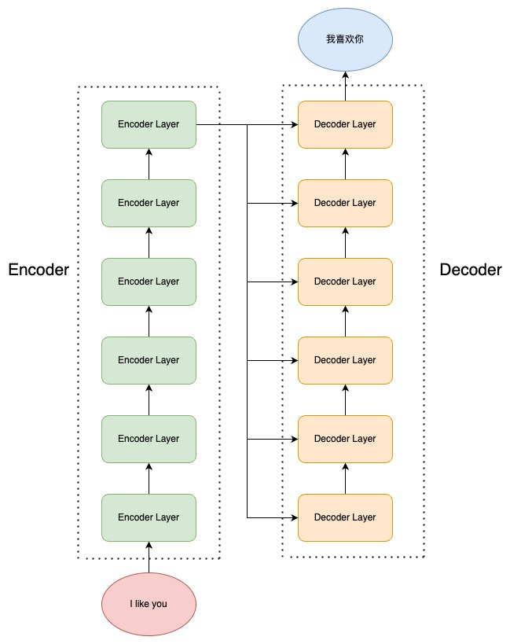

# 2.2 Encoder-Decoder

在上一节，我们详细介绍了 Transformer 的核心——Attention 机制。在《Attention is All You Need》一文中，作者通过仅使用 Attention 而抛弃传统的 RNN、CNN 架构搭建出 Transformer 模型，从而带来了 NLP 领域的大变革。在 Transformer 中，使用 Attention 机制的是其两个核心组件——Encoder（编码器）和 Decoder（解码器）。事实上，后续基于 Transformer 架构而来的预训练语言模型基本都是对 Encoder-Decoder 部分进行改进来构建新的模型架构，例如只使用 Encoder 的 BERT、只使用 Decoder 的 GPT 等。

在本节中，我们将以上一节所介绍的 Attention 机制为基础，从 Transformer 所针对的 Seq2Seq 任务出发，解析 Transformer 的 Encoder-Decoder 结构。

## 2.2.1 Seq2Seq 模型

Seq2Seq，即序列到序列，是一种经典 NLP 任务。具体而言，是指模型输入的是一个自然语言序列 $input = (x_1, x_2, x_3...x_n)$，输出的是一个可能不等长的自然语言序列 $output = (y_1, y_2, y_3...y_m)$。事实上，Seq2Seq 是 NLP 最经典的任务，几乎所有的 NLP 任务都可以视为 Seq2Seq 任务。例如文本分类任务，可以视为输出长度为 1 的目标序列（如在上式中 $m$ = 1）；词性标注任务，可以视为输出与输入序列等长的目标序列（如在上式中 $m$ = $n$）。

机器翻译任务即是一个经典的 Seq2Seq 任务，例如，我们的输入可能是“今天天气真好”，输出是“Today is a good day.”。Transformer 是一个经典的 Seq2Seq 模型，即模型的输入为文本序列，输出为另一个文本序列。事实上，Transformer 一开始正是应用在机器翻译任务上的。

对于 Seq2Seq 任务，一般的思路是对自然语言序列进行编码再解码。所谓编码，就是将输入的自然语言序列通过隐藏层编码成能够表征语义的向量（或矩阵），可以简单理解为更复杂的词向量表示。而解码，就是对输入的自然语言序列编码得到的向量或矩阵通过隐藏层输出，再解码成对应的自然语言目标序列。通过编码再解码，就可以实现 Seq2Seq 任务。

Transformer 中的 Encoder，就是用于上述的编码过程；Decoder 则用于上述的解码过程。Transformer 结构如下图：



Transformer 由 Encoder 和 Decoder 组成，每一个 Encoder（Decoder）又由 6个 Encoder（Decoder）Layer 组成。输入源序列会进入 Encoder 进行编码，到 Encoder Layer 的最顶层再将编码结果输出给 Decoder Layer 的每一层，通过 Decoder 解码后就可以得到输出目标序列了。

接下来，我们将首先介绍 Encoder 和 Decoder 内部传统神经网络的经典结构——全连接网络（FNN）、层归一化（Layer Norm）和残差连接（Residual Connection），然后进一步分析 Encoder 和 Decoder 的内部结构。

## 2.2.2 全连接网络

全连接网络（Full Neural Network，下简称 FNN），也就是我们在上一节提过的每一层的神经元都和上下两层的每一个神经元完全连接的网络结构。每一个 Encoder Layer 都包含一个上文讲的注意力机制和一个全连接层。全连接层的实现是较为简单的：

```python
class MLP(nn.Module):
    '''全连接层'''
    def __init__(self, dim: int, hidden_dim: int, dropout: float):
        super().__init__()
        # 定义第一层线性变换，从输入维度到隐藏维度
        self.w1 = nn.Linear(dim, hidden_dim, bias=False)
        # 定义第二层线性变换，从隐藏维度到输入维度
        self.w2 = nn.Linear(hidden_dim, dim, bias=False)
        # 定义dropout层，用于防止过拟合
        self.dropout = nn.Dropout(dropout)

    def forward(self, x):
        # 前向传播函数
        # 首先，输入x通过第一层线性变换和RELU激活函数
        # 然后，结果乘以输入x通过第三层线性变换的结果
        # 最后，通过第二层线性变换和dropout层
        return self.dropout(self.w2(F.relu(self.w1(x))))
    
```

注意，Transformer 的全连接层是由两个线性层中间加一个 RELU 激活函数组成的，以及全连接层还加入了一个 Dropout 层来防止过拟合。

## 2.2.3 层归一化

层归一化，也就是 Layer Norm，是深度学习中经典的归一化操作。神经网络主流的归一化一般有两种，批归一化（Batch Norm）和层归一化（Layer Norm）。

归一化核心是为了让不同层输入的取值范围或者分布能够比较一致。由于深度神经网络中每一层的输入都是上一层的输出，因此多层传递下，对网络中较高的层，之前的所有神经层的参数变化会导致其输入的分布发生较大的改变。也就是说，随着神经网络参数的更新，各层的输出分布是不相同的，且差异会随着网络深度的增大而增大。但是，需要预测的条件分布始终是相同的，从而也就造成了预测的误差。

因此，在深度神经网络中，往往需要归一化操作，将每一层的输入都归一化成标准正态分布。批归一化是指在一个 mini-batch 上进行归一化，相当于对一个 batch 对样本拆分出来一部分，首先计算样本的均值：

$$\mu_j = \frac{1}{m}\sum^{m}_{i=1}Z_j^{i}$$

其中，$Z_j^{i}$ 是样本 i 在第 j 个维度上的值，m 就是 mini-batch 的大小。

再计算样本的方差：

$$\sigma^2 = \frac{1}{m}\sum^{m}_{i=1}(Z_j^i - \mu_j)^2$$

最后，对每个样本的值减去均值再除以标准差来将这一个 mini-batch 的样本的分布转化为标准正态分布：

$$\widetilde{Z_j} = \frac{Z_j - \mu_j}{\sqrt{\sigma^2 + \epsilon}}$$

此处加上 $\epsilon$ 这一极小量是为了避免分母为0。

但是，批归一化存在一些缺陷，例如：

- 当显存有限，mini-batch 较小时，Batch Norm 取的样本的均值和方差不能反映全局的统计分布信息，从而导致效果变差；
- 对于在时间维度展开的 RNN，不同句子的同一分布大概率不同，所以 Batch Norm 的归一化会失去意义；
- 在训练时，Batch Norm 需要保存每个 step 的统计信息（均值和方差）。在测试时，由于变长句子的特性，测试集可能出现比训练集更长的句子，所以对于后面位置的 step，是没有训练的统计量使用的；
- 应用 Batch Norm，每个 step 都需要去保存和计算 batch 统计量，耗时又耗力

因此，出现了在深度神经网络中更常用、效果更好的层归一化（Layer Norm）。相较于 Batch Norm 在每一层统计所有样本的均值和方差，Layer Norm 在每个样本上计算其所有层的均值和方差，从而使每个样本的分布达到稳定。Layer Norm 的归一化方式其实和 Batch Norm 是完全一样的，只是统计统计量的维度不同。

基于上述进行归一化的公式，我们可以简单地实现一个 Layer Norm 层：

```python
class LayerNorm(nn.Module):
    ''' Layer Norm 层'''
    def __init__(self, features, eps=1e-6):
	super(LayerNorm, self).__init__()
    # 线性矩阵做映射
	self.a_2 = nn.Parameter(torch.ones(features))
	self.b_2 = nn.Parameter(torch.zeros(features))
	self.eps = eps
	
    def forward(self, x):
	# 在统计每个样本所有维度的值，求均值和方差
	mean = x.mean(-1, keepdim=True) # mean: [bsz, max_len, 1]
	std = x.std(-1, keepdim=True) # std: [bsz, max_len, 1]
    # 注意这里也在最后一个维度发生了广播
	return self.a_2 * (x - mean) / (std + self.eps) + self.b_2
```
注意，在我们上文实现的 Layer Norm 层中，有两个线性矩阵进行映射。

## 2.2.4 残差连接

由于 Transformer 模型结构较复杂、层数较深，​为了避免模型退化，Transformer 采用了残差连接的思想来连接每一个子层。残差连接，即下一层的输入不仅是上一层的输出，还包括上一层的输入。残差连接允许最底层信息直接传到最高层，让高层专注于残差的学习。

​例如，在 Encoder 中，在第一个子层，输入进入多头自注意力层的同时会直接传递到该层的输出，然后该层的输出会与原输入相加，再进行标准化。在第二个子层也是一样。即：
$$
x = x + MultiHeadSelfAttention(LayerNorm(x))
$$
$$
output = x + FNN(LayerNorm(x))
$$

我们在代码实现中，通过在层的 forward 计算中加上原值来实现残差连接：

```python
# 注意力计算
h = x + self.attention.forward(self.attention_norm(x))
# 经过全连接网络
out = h + self.feed_forward.forward(self.fnn_norm(h))
```

在上文代码中，self.attention_norm 和 self.fnn_norm 都是 LayerNorm 层，self.attn 是注意力层，而 self.feed_forward 是全连接层。

## 2.2.5 Encoder


在实现上述组件之后，我们可以搭建起 Transformer 的 Encoder。Encoder 由 N 个 Encoder Layer 组成，每一个 Encoder Layer 包括一个注意力层和一个全连接层。因此，我们可以首先实现一个 Encoder Layer：

```python
class EncoderLayer(nn.Module):
  '''Encoder层'''
    def __init__(self, config):
        super().__init__()
        # 一个 Layer 中有两个 LayerNorm，分别在 Attention 之前和 MLP 之前
        self.attention_norm = LayerNorm(args.n_embd)
        # Encoder 不需要掩码，传入 is_causal=False
        self.attention = MultiHeadAttention(args, is_causal=False)
        self.fnn_norm = LayerNorm(args.n_embd)
        self.feed_forward = MLP(args)

    def forward(self, x):
        # Layer Norm
        x = self.attention_norm(x)
        # 自注意力
        h = x + self.attention.forward(x, x, x)
        # 经过全连接网络
        out = h + self.feed_forward.forward(self.fnn_norm(h))
        return out
```

然后我们搭建一个 Encoder，由 N 个 Encoder Layer 组成，在最后会加入一个 Layer Norm 实现规范化：

```python
class Encoder(nn.Module):
    '''Encoder 块'''
    def __init__(self, args):
        super(Encoder, self).__init__() 
        # 一个 Encoder 由 N 个 Encoder Layer 组成
        self.layers = nn.ModuleList([EncoderLayer(args) for _ in range(args.n_layer)])
        self.norm = LayerNorm(args.n_embd)

    def forward(self, x):
        "分别通过 N 层 Encoder Layer"
        for layer in self.layers:
            x = layer(x)
        return self.norm(x)
```

通过 Encoder 的输出，就是输入编码之后的结果。

## 2.2.6 Decoder

类似的，我们也可以先搭建 Decoder Layer，再将 N 个 Decoder Layer 组装为 Decoder。但是和 Encoder 不同的是，Decoder 由两个注意力层和一个全连接层组成。第一个注意力层是一个掩码自注意力层，即使用 Mask 的注意力计算，保证每一个 token 只能使用该 token 之前的注意力分数；第二个注意力层是一个多头注意力层，该层将使用第一个注意力层的输出作为 query，使用 Encoder 的输出作为 key 和 value，来计算注意力分数。最后，再经过全连接层：

```python
class DecoderLayer(nn.Module):
  '''解码层'''
    def __init__(self, args):
        super().__init__()
        # 一个 Layer 中有三个 LayerNorm，分别在 Mask Attention 之前、Self Attention 之前和 MLP 之前
        self.attention_norm_1 = LayerNorm(args.n_embd)
        # Decoder 的第一个部分是 Mask Attention，传入 is_causal=True
        self.mask_attention = MultiHeadAttention(args, is_causal=True)
        self.attention_norm_2 = LayerNorm(args.n_embd)
        # Decoder 的第二个部分是 类似于 Encoder 的 Attention，传入 is_causal=False
        self.attention = MultiHeadAttention(args, is_causal=False)
        self.ffn_norm = LayerNorm(args.n_embd)
        # 第三个部分是 MLP
        self.feed_forward = MLP(config)

    def forward(self, x, enc_out):
        # Layer Norm
        x = self.attention_norm_1(x)
        # 掩码自注意力
        x = x + self.mask_attention.forward(x, x, x)
        # 多头注意力
        x = self.attention_norm_2(x)
        h = x + self.attention.forward(x, enc_out, enc_out)
        # 经过全连接网络
        out = h + self.feed_forward.forward(self.fnn_norm(h))
        return out
```

然后同样的，我们搭建一个 Decoder 块：

```python
class Decoder(nn.Module):
    '''解码器'''
    def __init__(self, args):
        super(Decoder, self).__init__() 
        # 一个 Decoder 由 N 个 Decoder Layer 组成
        self.layers = nn.ModuleList([DecoderLayer(args) for _ in range(args.n_layer)])
        self.norm = LayerNorm(args.n_embd)

    def forward(self, x, enc_out):
        "Pass the input (and mask) through each layer in turn."
        for layer in self.layers:
            x = layer(x, enc_out)
        return self.norm(x)
```

完成上述 Encoder、Decoder 的搭建，就完成了 Transformer 的核心部分，接下来将 Encoder、Decoder 拼接起来再加入 Embedding 层就可以搭建出完整的 Transformer 模型啦。