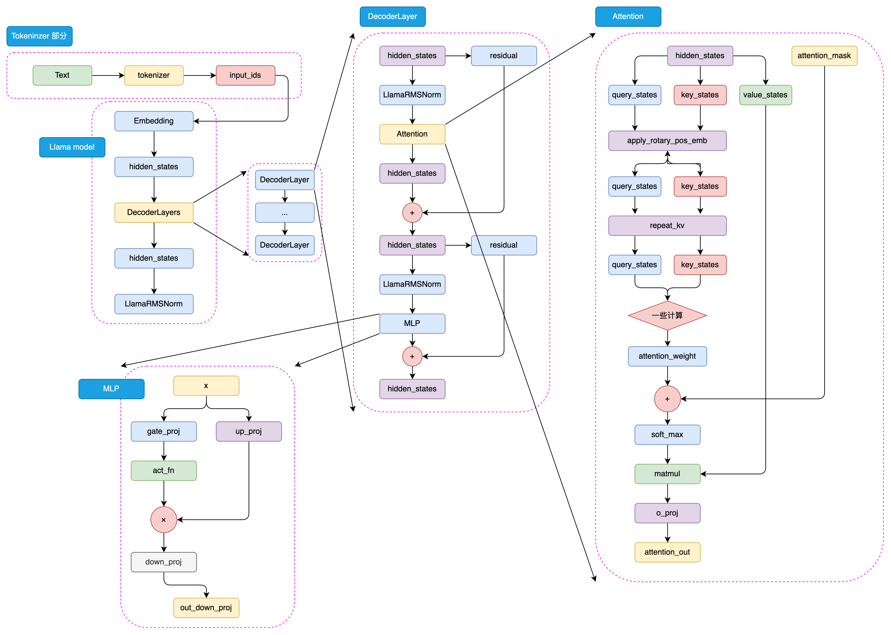
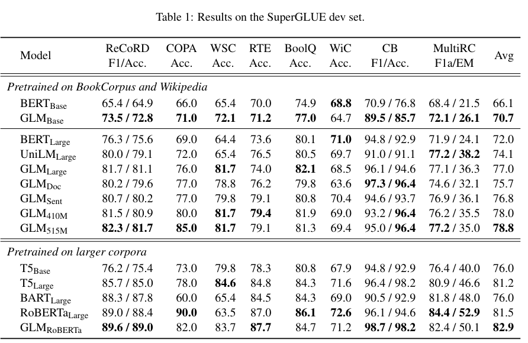
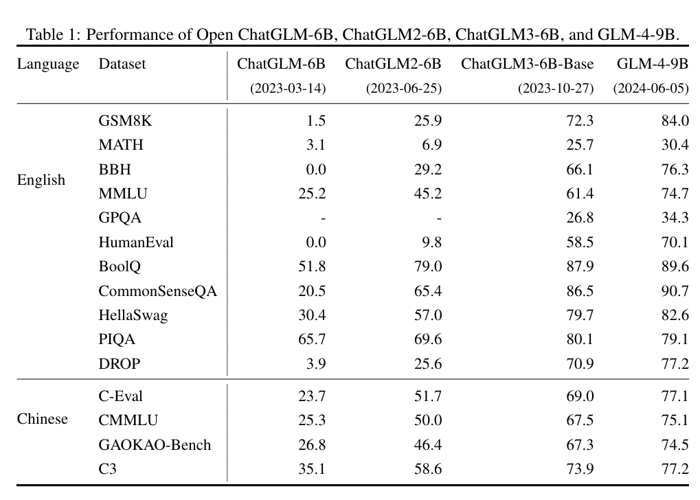

# 3.3 Decoder-Only PLM

在前两节中，我们分别讲解了由 Transformer 发展而来的两种模型架构——以 BERT 为代表的 Encoder-Only 模型和以 T5 为代表的 Encoder-Decoder 模型。那么，很自然可以想见，除了上述两种架构，还可以有一种模型架构——Decoder-Only，即只使用 Decoder 堆叠而成的模型。

事实上，Decoder-Only 就是目前大火的 LLM 的基础架构，目前所有的 LLM 基本都是 Decoder-Only 模型（RWKV、Mamba 等非 Transformer 架构除外）。而引发 LLM 热潮的 ChatGPT，正是 Decoder-Only 系列的代表模型 GPT 系列模型的大成之作。而目前作为开源 LLM 基本架构的 LLaMA 模型，也正是在 GPT 的模型架构基础上优化发展而来。因此，在本节中，我们不但会详细分析 Decoder-Only 代表模型 GPT 的原理、架构和特点，还会深入到目前的主流开源 LLM，分析它们的结构、特点，结合之前对 Transformer 系列其他模型的分析，帮助大家深入理解当下被寄予厚望、被认为是 AGI 必经之路的 LLM 是如何一步步从传统 PLM 中发展而来的。

首先，让我们学习打开 LLM 世界大门的代表模型——由 OpenAI 发布的 GPT。

## 3.3.1 GPT

GPT，即 Generative Pre-Training Language Model，是由 OpenAI 团队于 2018年发布的预训练语言模型。虽然学界普遍认可 BERT 作为预训练语言模型时代的代表，但首先明确提出预训练-微调思想的模型其实是 GPT。GPT 提出了通用预训练的概念，也就是在海量无监督语料上预训练，进而在每个特定任务上进行微调，从而实现这些任务的巨大收益。虽然在发布之初，由于性能略输于不久后发布的 BERT，没能取得轰动性成果，也没能让 GPT 所使用的 Decoder-Only 架构成为学界研究的主流，但 OpenAI 团队坚定地选择了不断扩大预训练数据、增加模型参数，在 GPT 架构上不断优化，最终在 2020年发布的 GPT-3 成就了 LLM 时代的基础，并以 GPT-3 为基座模型的 ChatGPT 成功打开新时代的大门，成为 LLM 时代的最强竞争者也是目前的最大赢家。

本节将以 GPT 为例，分别从模型架构、预训练任务、GPT 系列模型的发展历程等三个方面深入分析 GPT 及其代表的 Decoder-Only 模型，并进一步引出当前的主流 LLM 架构——LLaMA。

#### （1） 模型架构——Decoder Only

可以看到，GPT 的整体结构和 BERT 是有一些类似的，只是相较于 BERT 的 Encoder，选择使用了 Decoder 来进行模型结构的堆叠。由于 Decoder-Only 结构也天生适用于文本生成任务，所以相较于更贴合 NLU 任务设计的 BERT，GPT 和 T5 的模型设计更契合于 NLG 任务和 Seq2Seq 任务。同样，对于一个自然语言文本的输入，先通过 tokenizer 进行分词并转化为对应词典序号的 input_ids。

输入的 input_ids 首先通过 Embedding 层，再经过 Positional Embedding 进行位置编码。不同于 BERT 选择了可训练的全连接层作为位置编码，GPT 沿用了 Transformer 的经典 Sinusoidal 位置编码，即通过三角函数进行绝对位置编码，此处就不再赘述，感兴趣的读者可以参考第二章 Transformer 模型细节的解析。

通过 Embedding 层和 Positional Embedding 层编码成 hidden_states 之后，就可以进入到解码器（Decoder），第一代 GPT 模型和原始 Transformer 模型类似，选择了 12层解码器层，但是在解码器层的内部，相较于 Transformer 原始 Decoder 层的双注意力层设计，GPT 的 Decoder 层反而更像 Encoder 层一点。由于不再有 Encoder 的编码输入，Decoder 层仅保留了一个带掩码的注意力层，并且将 LayerNorm 层从 Transformer 的注意力层之后提到了注意力层之前。hidden_states 输入 Decoder 层之后，会先进行 LayerNorm，再进行掩码注意力计算，然后经过残差连接和再一次 LayerNorm 进入到 MLP 中并得到最后输出。

由于不存在 Encoder 的编码结果，Decoder 层中的掩码注意力也是自注意力计算。也就是对一个输入的 hidden_states，会通过三个参数矩阵来生成 query、key 和 value，而不再是像 Transformer 中的 Decoder 那样由 Encoder 输出作为 key 和 value。后续的注意力计算过程则和 BERT 类似，只是在计算得到注意力权重之后，通过掩码矩阵来遮蔽了未来 token 的注意力权重，从而限制每一个 token 只能关注到它之前 token 的注意力，来实现掩码自注意力的计算。

另外一个结构上的区别在于，GPT 的 MLP 层没有选择线性矩阵来进行特征提取，而是选择了两个一维卷积核来提取，不过，从效果上说这两者是没有太大区别的。通过 N 个 Decoder 层后的 hidden_states 最后经过线性矩阵映射到词表维度，就可以转化成自然语言的 token，从而生成我们的目标序列。

#### （2）预训练任务——CLM

Decoder-Only 的模型结构往往更适合于文本生成任务，因此，Decoder-Only 模型往往选择了最传统也最直接的预训练任务——因果语言模型，Casual Language Model，下简称 CLM。

CLM 可以看作 N-gram 语言模型的一个直接扩展。N-gram 语言模型是基于前 N 个 token 来预测下一个 token，CLM 则是基于一个自然语言序列的前面所有 token 来预测下一个 token，通过不断重复该过程来实现目标文本序列的生成。也就是说，CLM 是一个经典的补全形式。例如，CLM 的输入和输出可以是：

    input: 今天天气
    output: 今天天气很

    input: 今天天气很
    output：今天天气很好

因此，对于一个输入目标序列长度为 256，期待输出序列长度为 256 的任务，模型会不断根据前 256 个 token、257个 token（输入+预测出来的第一个 token）...... 进行 256 次计算，最后生成一个序列长度为 512 的输出文本，这个输出文本前 256 个 token 为输入，后 256 个 token 就是我们期待的模型输出。

在前面我们说过，BERT 之所以可以采用预训练+微调的范式取得重大突破，正是因为其选择的 MLM、NSP 可以在海量无监督语料上直接训练——而很明显，CLM 是更直接的预训练任务，其天生和人类书写自然语言文本的习惯相契合，也和下游任务直接匹配，相对于 MLM 任务更加直接，可以在任何自然语言文本上直接应用。因此，CLM 也可以使用海量的自然语言语料进行大规模的预训练。

#### （3）GPT 系列模型的发展

自 GPT-1 推出开始，OpenAI 一直坚信 Decoder-Only 的模型结构和“体量即正义”的优化思路，不断扩大预训练数据集、模型体量并对模型做出一些小的优化和修正，来不断探索更强大的预训练模型。从被 BERT 压制的 GPT-1，到没有引起足够关注的 GPT-2，再到激发了涌现能力、带来大模型时代的 GPT-3，最后带来了跨时代的 ChatGPT，OpenAI 通过数十年的努力证明了其思路的正确性。

下表总结了从 GPT-1 到 GPT-3 的模型结构、预训练语料大小的变化：

模型 | Decoder Layer | Hidden_size | 注意力头数 | 注意力维度 | 总参数量 | 预训练语料 
---- | --------------|------------|------------|----------|----------|----------
GPT-1|12|3072|12|768|0.12B|5GB
GPT-2|48|6400|25|1600|1.5B|40GB
GPT-3|96|49152|96|12288|175B|570GB

GPT-1 是 GPT 系列的开山之作，也是第一个使用 Decoder-Only 的预训练模型。但是，GPT-1 的模型体量和预训练数据都较少，沿承了传统 Transformer 的模型结构，使用了 12层 Decoder Block 和 768 的隐藏层维度，模型参数量仅有 1.17亿（0.12B），在大小为 5GB 的 BooksCorpus 数据集上预训练得到。可以看到，GPT-1 的参数规模与预训练规模和 BERT-base 是大致相当的，但其表现相较于 BERT-base 却有所不如，这也是 GPT 系列模型没能成为预训练语言模型时代的代表的原因。

GPT-2 则是 OpenAI 在 GPT-1 的基础上进一步探究预训练语言模型多任务学习能力的产物。GPT-2 的模型结构和 GPT-1 大致相当，只是扩大了模型参数规模、将 Post-Norm 改为了 Pre-Norm（也就是先进行 LayerNorm 计算，再进入注意力层计算）。这些改动的核心原因在于，由于模型层数增加、体量增大，梯度消失和爆炸的风险也不断增加，为了使模型梯度更稳定对上述结构进行了优化。

GPT-2 的核心改进是大幅增加了预训练数据集和模型体量。GPT-2 的 Decoder Block 层数达到了48（注意，GPT-2 共发布了四种规格的模型，此处我们仅指规格最大的 GPT-2 模型），隐藏层维度达到了 1600，模型整体参数量达 15亿（1.5B），使用了自己抓取的 40GB 大小的 WebText 数据集进行预训练，不管是模型结构还是预训练大小都超过了 1代一个数量级。

GPT-2 的另一个重大突破是以 zero-shot（零样本学习）为主要目标，也就是不对模型进行微调，直接要求模型解决任务。例如，在传统的预训练-微调范式中，我们要解决一个问题，一般需要收集几百上千的训练样本，在这些训练样本上微调预训练语言模型来实现该问题的解决。而 zero-shot 则强调不使用任何训练样本，直接通过向预训练语言模型描述问题来去解决该问题。zero-shot 的思路自然是比预训练-微调范式更进一步、更高效的自然语言范式，但是在 GPT-2 的时代，模型能力还不足够支撑较好的 zero-shot 效果，在大模型时代，zero-shot 及其延伸出的 few-shot（少样本学习）才开始逐渐成为主流。

GPT-3 则是更进一步展示了 OpenAI“力大砖飞”的核心思路，也是 LLM 的开创之作。在 GPT-2 的基础上，OpenAI 进一步增大了模型体量和预训练数据量，整体参数量达 175B，是当之无愧的“大型语言模型”。在模型结构上，基本没有大的改进，只是由于巨大的模型体量使用了稀疏注意力机制来取代传统的注意力机制。在预训练数据上，则是分别从 CC、WebText、维基百科等大型语料集中采样，共采样了 45T、清洗后 570GB 的数据。根据推算，GPT-3 需要在 1024张 A100（80GB 显存）的分布式训练集群上训练 1个月。

之所以说 GPT-3 是 LLM 的开创之作，除去其巨大的体量带来了涌现能力的凸显外，还在于其提出了 few-shot 的重要思想。few-shot 是在 zero-shot 上的改进，研究者发现即使是 175B 大小的 GPT-3，想要在 zero-shot 上取得较好的表现仍然是一件较为困难的事情。而 few-shot 是对 zero-shot 的一个折中，旨在提供给模型少样的示例来教会它完成任务。few-shot 一般会在 prompt（也就是模型的输入）中增加 3~5个示例，来帮助模型理解。例如，对于情感分类任务：

    zero-shot：请你判断‘这真是一个绝佳的机会’的情感是正向还是负向，如果是正向，输出1；否则输出0

    few-shot：请你判断‘这真是一个绝佳的机会’的情感是正向还是负向，如果是正向，输出1；否则输出0。你可以参考以下示例来判断：‘你的表现非常好’——1；‘太糟糕了’——0；‘真是一个好主意’——1。

通过给模型提供少量示例，模型可以取得远好于 zero-shot 的良好表现。few-shot 也被称为上下文学习（In-context Learning），即让模型从提供的上下文中的示例里学习问题的解决方法。GPT-3 在 few-shot 上展现的强大能力，为 NLP 的突破带来了重要进展。如果对于绝大部分任务都可以通过人为构造 3~5个示例就能让模型解决，其效率将远高于传统的预训练-微调范式，意味着 NLP 的进一步落地应用成为可能——而这，也正是 LLM 的核心优势。

在 GPT 系列模型的基础上，通过引入预训练-指令微调-人类反馈强化学习的三阶段训练，OpenAI 发布了跨时代的 ChatGPT，引发了大模型的热潮。也正是在 GPT-3 及 ChatGPT 的基础上，LLaMA、ChatGLM 等模型的发布进一步揭示了 LLM 的无尽潜力。在下一节，我们将深入剖析目前 LLM 的普适架构——LLaMA。

## 3.3.2 LLaMA

Llama模型是由Meta（前Facebook）开发的一系列大型预训练语言模型。从Llama-1到Llama-3，Llama系列模型展示了大规模预训练语言模型的演进及其在实际应用中的显著潜力。

### （1） 模型架构——Decoder Only

与GPT系列模型一样，Llama模型也是基于Decoder-Only架构的预训练语言模型。Llama模型的整体结构与GPT系列模型类似，只是在模型规模和预训练数据集上有所不同。以下是Llama-3模型的架构示意图：

与GPT类似，llama模型的处理流程也始于将输入文本通过tokenizer进行编码，转化为一系列的input_ids。这些input_ids是模型能够理解和处理的数据格式。接下来，这些input_ids会经过embedding层的转换，这里每个input_id会被映射到一个高维空间中的向量，即词向量。同时，输入文本的位置信息也会通过positional embedding层被编码，以确保模型能够理解词序上下文信息。

这样，input_ids经过embedding层和positional embedding层的结合，形成了hidden_states。hidden_states包含了输入文本的语义和位置信息，是模型进行后续处理的基础，hidden_states随后被输入到模型的decoder层。

在decoder层中，hidden_states会经历一系列的处理，这些处理由多个decoder block组成。每个decoder block都是模型的核心组成部分，它们负责对hidden_states进行深入的分析和转换。在每个decoder block内部，首先是一个masked self-attention层。在这个层中，模型会分别计算query、key和value这三个向量。这些向量是通过hidden_states线性变换得到的，它们是计算注意力权重的基础。然后使用softmax函数计算attention score，这个分数反映了不同位置之间的关联强度。通过attention score，模型能够确定在生成当前词时，应该给予不同位置的hidden_states多大的关注。然后，模型将value向量与attention score相乘，得到加权后的value，这就是attention的结果。

在完成masked self-attention层之后，hidden_states会进入MLP层。在这个多层感知机层中，模型通过两个全连接层对hidden_states进行进一步的特征提取。第一个全连接层将hidden_states映射到一个中间维度，然后通过激活函数进行非线性变换，增加模型的非线性能力。第二个全连接层则将特征再次映射回原始的hidden_states维度。

最后，经过多个decoder block的处理，hidden_states会通过一个线性层进行最终的映射，这个线性层的输出维度与词表维度相同。这样，模型就可以根据hidden_states生成目标序列的概率分布，进而通过采样或贪婪解码等方法，生成最终的输出序列。这一过程体现了llama模型强大的序列生成能力。

### （2） Llama模型的发展历程

#### Llama-1 系列：

- Meta于2023年2月发布了Llama-1，包括7B、13B、30B和65B四个参数量版本。
- 这些模型在超过1T token的语料上进行了预训练，其中最大的65B参数模型在2,048张A100 80G GPU上训练了近21天。
- Llama-1因其开源性和优异性能迅速成为开源社区中最受欢迎的大模型之一。

#### Llama-2 系列：

- 2023年7月，Meta发布了Llama-2，包含7B、13B、34B和70B四个参数量版本，除了34B模型外，其他均已开源。
- Llama-2将预训练的语料扩充到了2T token，并将模型的上下文长度从2,048翻倍到了4,096。
- 引入了分组查询注意力机制（Grouped-Query Attention, GQA）等技术。

#### Llama-3 系列：

- 2024年4月，Meta发布了Llama-3，包括8B和70B两个参数量版本，同时透露400B的Llama-3还在训练中。
- Llama-3支持8K长文本，并采用了编码效率更高的tokenizer，词表大小为128K。
- 使用了超过15T token的预训练语料，是Llama-2的7倍多。

Llama模型以其技术创新、多参数版本、大规模预训练和高效架构设计而著称。模型支持从7亿到数百亿不等的参数量，适应不同规模的应用需求。Llama-1以其开源性和优异性能迅速受到社区欢迎，而Llama-2和Llama-3进一步通过引入分组查询注意力机制和支持更长文本输入，显著提升了模型性能和应用范围。特别是Llama-3，通过采用128K词表大小的高效tokenizer和15T token的庞大训练数据，实现了在多语言和多任务处理上的重大进步。Meta对模型安全性和社区支持的持续关注，预示着Llama将继续作为AI技术发展的重要推动力，促进全球范围内的技术应用和创新。

## 3.3.3 GLM

GLM 系列模型是由智谱开发的主流中文 LLM 之一，包括 ChatGLM1、2、3及 GLM-4 系列模型，覆盖了指令理解、代码生成等多种应用场景，曾在多种中文评估集上达到 SOTA 性能。

ChatGLM-6B 是 GLM 系列的开山之作，也是 2023年国内最早的开源中文 LLM，也是最早提出不同于 GPT、LLaMA 的独特模型架构的 LLM。在整个中文 LLM 的发展历程中，GLM 具有独特且重大的技术意义。本节将简要叙述 GLM 系列的发展，并介绍其不同于 GPT、LLaMA 系列模型的独特技术思路。

### （1）模型架构-相对于 GPT 的略微修正

GLM 最初是由清华计算机系推出的一种通用语言模型基座，其核心思路是在传统 CLM 预训练任务基础上，加入 MLM 思想，从而构建一个在 NLG 和 NLU 任务上都具有良好表现的统一模型。

在整体模型结构上，GLM 和 GPT 大致类似，均是 Decoder-Only 的结构，仅有三点细微差异：

1. 使用 Post Norm 而非 Pre Norm。Post Norm 是指在进行残差连接计算时，先完成残差计算，再进行 LayerNorm 计算；而类似于 GPT、LLaMA 等模型都使用了 Pre Norm，也就是先进行 LayerNorm 计算，再进行残差的计算。相对而言，Post Norm 由于在残差之后做归一化，对参数正则化的效果更强，进而模型的鲁棒性也会更好；Pre Norm相对于因为有一部分参数直接加在了后面，不需要对这部分参数进行正则化，正好可以防止模型的梯度爆炸或者梯度消失。因此，对于更大体量的模型来说，一般认为 Pre Norm 效果会更好。但 GLM 论文提出，使用 Post Norm 可以避免 LLM 的数值错误（虽然主流 LLM 仍然使用了 Pre Norm）；

2. 使用单个线性层实现最终 token 的预测，而不是使用 MLP；这样的结构更加简单也更加鲁棒，即减少了最终输出的参数量，将更大的参数量放在了模型本身；

3. 激活函数从 ReLU 换成了 GeLUS。ReLU 是传统的激活函数，其核心计算逻辑为去除小于 0的传播，保留大于 0的传播；GeLUS 核心是对接近于 0的正向传播，做了一个非线性映射，保证了激活函数后的非线性输出，具有一定的连续性。

### （2）预训练任务-GLM

GLM 的核心创新点主要在于其提出的 GLM（General Language Model，通用语言模型）任务，这也是 GLM 的名字由来。GLM 是一种结合了自编码思想和自回归思想的预训练方法。所谓自编码思想，其实也就是 MLM 的任务学习思路，在输入文本中随机删除连续的 tokens，要求模型学习被删除的 tokens；所谓自回归思想，其实就是传统的 CLM 任务学习思路，也就是要求模型按顺序重建连续 tokens。

GLM 通过优化一个自回归空白填充任务来实现 MLM 与 CLM 思想的结合。其核心思想是，对于一个输入序列，会类似于 MLM 一样进行随机的掩码，但遮蔽的不是和 MLM 一样的单个 token，而是每次遮蔽一连串 token；模型在学习时，既需要使用遮蔽部分的上下文预测遮蔽部分，在遮蔽部分内部又需要以 CLM 的方式完成被遮蔽的 tokens 的预测。例如，输入和输出可能是：

    输入：I <MASK> because you <MASK>
    输出：<MASK> - love you; <MASK> - are a wonderful person

通过将 MLM 与 CLM 思想相结合，既适配逐个 token 生成的生成类任务，也迫使模型从前后两个方向学习输入文本的隐含关系从而适配了理解类任务。使用 GLM 预训练任务产出的 GLM 模型，在一定程度上展现了其超出同体量 BERT 系模型的优越性能：

不过，GLM 预训练任务更多的优势还是展现在预训练模型时代，迈入 LLM 时代后，针对于超大规模、体量的预训练，CLM 展现出远超 MLM 的优势。通过将模型体量加大、预训练规模扩大，CLM 预训练得到的生成模型在文本理解上也能具有超出 MLM 训练的理解模型的能力，因此，ChatGLM 系列模型也仅在第一代模型使用了 GLM 的预训练思想，从 ChatGLM2 开始，还是回归了传统的 CLM 建模。虽然从 LLM 的整体发展路径来看，GLM 预训练任务似乎是一个失败的尝试，但通过精巧的设计将 CLM 与 MLM 融合，并第一时间产出了中文开源的原生 LLM，其思路仍然存在较大的借鉴意义。

### （3）GLM 家族的发展

在 GLM 模型（即使用原生 GLM 架构及预训练任务的早期预训练模型）的基础上，参考 ChatGPT 的技术思路进行 SFT 和 RLHF，智谱于 23年 3月发布了第一个中文开源 LLM ChatGLM-6B，成为了众多中文 LLM 研究者的起点。ChatGLM-6B 在 1T 语料上进行预训练，支持 2K 的上下文长度。

在 23年 6月，智谱就开源了 ChatGLM2-6B。相对于一代，ChatGLM2 将上下文长度扩展到了 32K，通过更大的预训练规模实现了模型性能的大幅度突破。不过，在 ChatGLM2 中，模型架构就基本回归了 LLaMA 架构，引入 MQA 的注意力机制，预训练任务也回归经典的 CLM，放弃了 GLM 的失败尝试。

ChatGLM3-6B 发布于 23年 10月，相对于二代在语义、数学、推理、代码和知识方面都达到了当时的 SOTA 性能，但是官方给出的技术报告说明 ChatGLM3 在模型架构上相对二代没有变化，最主要的优化来源是更多样化的训练数据集、更充足的训练步骤和更优化的训练策略。ChatGLM3 的另一个重要改进在于其开始支持函数调用与代码解释器，开发者可以直接使用开源的 ChatGLM3 来实现 Agent 开发，具有更广泛的应用价值。

2024年 1月，智谱发布了支持 128K 上下文，包括多种类型的 GLM-4 系列模型，评估其在英文基准上达到了 GPT-4 的水平。不过，智谱并未直接开源 GLM-4，而是开源了其轻量级版本 GLM-4-9B 模型，其在 1T token 的多语言语料库上进行预训练，上下文长度为 8K，并使用与 GLM-4 相同的管道和数据进行后训练。在训练计算量较少的情况下，其超越了 Llama-3-8B，并支持 GLM-4 中所有工具的功能。

下表展示了 GLM 系列模型在基准集上的表现演进：

**参考资料**

1. [Improving Language Understanding by Generative Pre-Training](https://cdn.openai.com/research-covers/language-unsupervised/language_understanding_paper.pdf)
2. [Language Models are Unsupervised Multitask Learners](https://d4mucfpksywv.cloudfront.net/better-language-models/language_models_are_unsupervised_multitask_learners.pdf)
3. [Language Models are Few-Shot Learners](https://arxiv.org/pdf/2005.14165)
4. [万字长文带你梳理Llama开源家族：从Llama-1到Llama-3](https://mp.weixin.qq.com/s/5_VnzP3JmOB0D5geV5HRFg)
5. [ChatGLM: A Family of Large Language Models from GLM-130B to GLM-4 All Tools](https://arxiv.org/abs/2406.12793)
6. [GLM: General Language Model Pretraining with Autoregressive Blank Infilling](https://arxiv.org/abs/2103.10360)