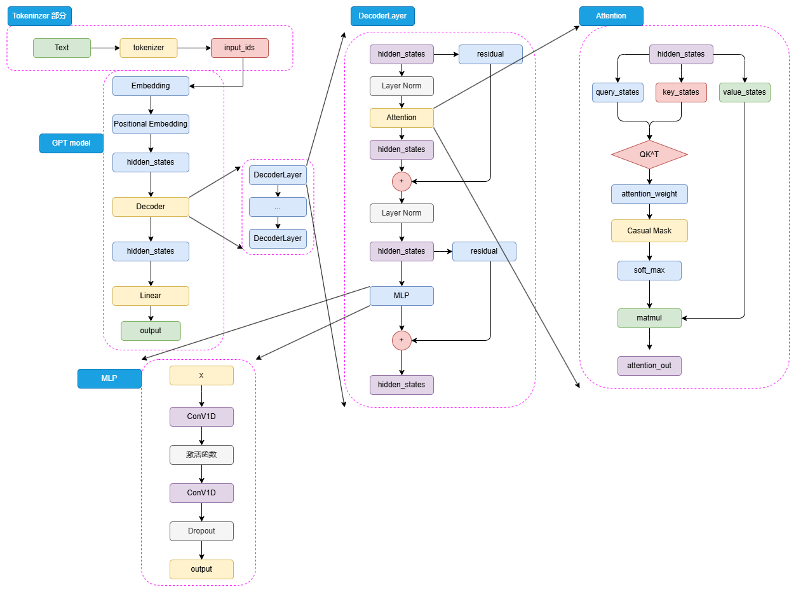

# 3.3 Decoder-Only PLM

在前两节中，我们分别讲解了由 Transformer 发展而来的两种模型架构——以 BERT 为代表的 Encoder-Only 模型和以 T5 为代表的 Encoder-Decoder 模型。那么，很自然可以想见，除了上述两种架构，还可以有一种模型架构——Decoder-Only，即只使用 Decoder 堆叠而成的模型。

事实上，Decoder-Only 就是目前大火的 LLM 的基础架构，目前所有的 LLM 基本都是 Decoder-Only 模型（RWKV、Mamba 等非 Transformer 架构除外）。而引发 LLM 热潮的 ChatGPT，正是 Decoder-Only 系列的代表模型 GPT 系列模型的大成之作。而目前作为开源 LLM 基本架构的 LLaMA 模型，也正是在 GPT 的模型架构基础上优化发展而来。因此，在本节中，我们不但会详细分析 Decoder-Only 代表模型 GPT 的原理、架构和特点，还会深入到目前的主流开源 LLM，分析它们的结构、特点，结合之前对 Transformer 系列其他模型的分析，帮助大家深入理解当下被寄予厚望、被认为是 AGI 必经之路的 LLM 是如何一步步从传统 PLM 中发展而来的。

首先，让我们学习打开 LLM 世界大门的代表模型——由 OpenAI 发布的 GPT。

## 3.3.1 GPT

GPT，即 Generative Pre-Training Language Model，是由 OpenAI 团队于 2018年发布的预训练语言模型。虽然学界普遍认可 BERT 作为预训练语言模型时代的代表，但首先明确提出预训练-微调思想的模型其实是 GPT。GPT 提出了通用预训练的概念，也就是在海量无监督语料上预训练，进而在每个特定任务上进行微调，从而实现这些任务的巨大收益。虽然在发布之初，由于性能略输于不久后发布的 BERT，没能取得轰动性成果，也没能让 GPT 所使用的 Decoder-Only 架构成为学界研究的主流，但 OpenAI 团队坚定地选择了不断扩大预训练数据、增加模型参数，在 GPT 架构上不断优化，最终在 2020年发布的 GPT-3 成就了 LLM 时代的基础，并以 GPT-3 为基座模型的 ChatGPT 成功打开新时代的大门，成为 LLM 时代的最强竞争者也是目前的最大赢家。

本节将以 GPT 为例，分别从模型架构、预训练任务、GPT 系列模型的发展历程等三个方面深入分析 GPT 及其代表的 Decoder-Only 模型，并进一步引出当前的主流 LLM 架构——LLaMA。

#### （1） 模型架构——Decoder Only

可以看到，GPT 的整体结构和 BERT 是有一些类似的，只是相较于 BERT 的 Encoder，选择使用了 Decoder 来进行模型结构的堆叠。由于 Decoder-Only 结构也天生适用于文本生成任务，所以相较于更贴合 NLU 任务设计的 BERT，GPT 和 T5 的模型设计更契合于 NLG 任务和 Seq2Seq 任务。同样，对于一个自然语言文本的输入，先通过 tokenizer 进行分词并转化为对应词典序号的 input_ids。

输入的 input_ids 首先通过 Embedding 层，再经过 Positional Embedding 进行位置编码。不同于 BERT 选择了可训练的全连接层作为位置编码，GPT 沿用了 Transformer 的经典 Sinusoidal 位置编码，即通过三角函数进行绝对位置编码，此处就不再赘述，感兴趣的读者可以参考第二章 Transformer 模型细节的解析。

通过 Embedding 层和 Positional Embedding 层编码成 hidden_states 之后，就可以进入到解码器（Decoder），第一代 GPT 模型和原始 Transformer 模型类似，选择了 12层解码器层，但是在解码器层的内部，相较于 Transformer 原始 Decoder 层的双注意力层设计，GPT 的 Decoder 层反而更像 Encoder 层一点。由于不再有 Encoder 的编码输入，Decoder 层仅保留了一个带掩码的注意力层，并且将 LayerNorm 层从 Transformer 的注意力层之后提到了注意力层之前。hidden_states 输入 Decoder 层之后，会先进行 LayerNorm，再进行掩码注意力计算，然后经过残差连接和再一次 LayerNorm 进入到 MLP 中并得到最后输出。

由于不存在 Encoder 的编码结果，Decoder 层中的掩码注意力也是自注意力计算。也就是对一个输入的 hidden_states，会通过三个参数矩阵来生成 query、key 和 value，而不再是像 Transformer 中的 Decoder 那样由 Encoder 输出作为 key 和 value。后续的注意力计算过程则和 BERT 类似，只是在计算得到注意力权重之后，通过掩码矩阵来遮蔽了未来 token 的注意力权重，从而限制每一个 token 只能关注到它之前 token 的注意力，来实现掩码自注意力的计算。

另外一个结构上的区别在于，GPT 的 MLP 层没有选择线性矩阵来进行特征提取，而是选择了两个一维卷积核来提取，不过，从效果上说这两者是没有太大区别的。通过 N 个 Decoder 层后的 hidden_states 最后经过线性矩阵映射到词表维度，就可以转化成自然语言的 token，从而生成我们的目标序列。

#### （2）预训练任务——CLM

Decoder-Only 的模型结构往往更适合于文本生成任务，因此，Decoder-Only 模型往往选择了最传统也最直接的预训练任务——因果语言模型，Casual Language Model，下简称 CLM。

CLM 可以看作 N-gram 语言模型的一个直接扩展。N-gram 语言模型是基于前 N 个 token 来预测下一个 token，CLM 则是基于一个自然语言序列的前面所有 token 来预测下一个 token，通过不断重复该过程来实现目标文本序列的生成。也就是说，CLM 是一个经典的补全形式。例如，CLM 的输入和输出可以是：

    input: 今天天气
    output: 今天天气很

    input: 今天天气很
    output：今天天气很好

因此，对于一个输入目标序列长度为 256，期待输出序列长度为 256 的任务，模型会不断根据前 256 个 token、257个 token（输入+预测出来的第一个 token）...... 进行 256 次计算，最后生成一个序列长度为 512 的输出文本，这个输出文本前 256 个 token 为输入，后 256 个 token 就是我们期待的模型输出。

在前面我们说过，BERT 之所以可以采用预训练+微调的范式取得重大突破，正是因为其选择的 MLM、NSP 可以在海量无监督语料上直接训练——而很明显，CLM 是更直接的预训练任务，其天生和人类书写自然语言文本的习惯相契合，也和下游任务直接匹配，相对于 MLM 任务更加直接，可以在任何自然语言文本上直接应用。因此，CLM 也可以使用海量的自然语言语料进行大规模的预训练。

**参考资料**

1. [Improving Language Understanding by Generative Pre-Training](https://cdn.openai.com/research-covers/language-unsupervised/language_understanding_paper.pdf)