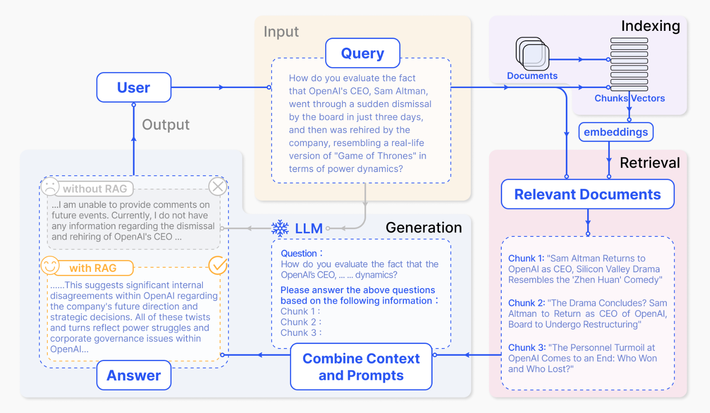

# 7.3 RAG 

## 7.3.1 RAG 的基本原理

大语言模型（LLM）在生成内容时，虽然具备强大的语言理解和生成能力，但也面临着一些挑战。例如，LLM有时会生成不准确或误导性的内容，这被称为大模型“幻觉”。此外，模型所依赖的训练数据可能过时，尤其在面对最新的信息时，生成结果的准确性和时效性难以保证。对于特定领域的专业知识，LLM 的处理效率也较低，无法深入理解复杂的领域知识。因此，如何提升大模型的生成质量和效率，成为了当前研究的重要方向。

在这样的背景下，检索增强生成（Retrieval-Augmented Generation，RAG）技术应运而生，成为AI领域中的一大创新趋势。RAG 在生成答案之前，首先从外部的大规模文档数据库中检索出相关信息，并将这些信息融入到生成过程之中，从而指导和优化语言模型的输出。这一流程不仅极大地提升了内容生成的准确性和相关性，还使得生成的内容更加符合实时性要求。

RAG 的核心原理在于将“检索”与“生成”结合：当用户提出查询时，系统首先通过检索模块找到与问题相关的文本片段，然后将这些片段作为附加信息传递给语言模型，模型据此生成更为精准和可靠的回答。通过这种方式，RAG 有效缓解了大语言模型的“幻觉”问题，因为生成的内容建立在真实文档的基础上，使得答案更具可追溯性和可信度。同时，由于引入了最新的信息源，RAG 技术大大加快了知识更新速度，使得系统可以及时吸收和反映最新的领域动态。

## 7.3.2 搭建一个 RAG 框架

接下来我会带领大家一步一步实现一个简单的RAG模型，这个模型是基于RAG的一个简化版本，我们称之为Tiny-RAG。Tiny-RAG只包含了RAG的核心功能，即检索和生成，其目的是帮助大家更好地理解RAG模型的原理和实现。

### Step 1: RAG流程介绍

RAG通过在语言模型生成答案之前，先从广泛的文档数据库中检索相关信息，然后利用这些信息来引导生成过程，从而极大地提升了内容的准确性和相关性。RAG有效地缓解了幻觉问题，提高了知识更新的速度，并增强了内容生成的可追溯性，使得大型语言模型在实际应用中变得更加实用和可信。

RAG的基本结构有哪些呢？

- 向量化模块：用来将文档片段向量化。
- 文档加载和切分模块：用来加载文档并切分成文档片段。
- 数据库：存放文档片段及其对应的向量表示。
- 检索模块：根据Query（问题）检索相关的文档片段。
- 大模型模块：根据检索到的文档回答用户的问题。

上述这些也就是TinyRAG的所有模块内容。


接下来，让我们梳理一下RAG的流程是什么样的呢？

- **索引**：将文档库分割成较短的片段，并通过编码器构建向量索引。
- **检索**：根据问题和片段的相似度检索相关文档片段。
- **生成**：以检索到的上下文为条件，生成问题的回答。

如下图所示的流程，图片出处 ***[Retrieval-Augmented Generation for Large Language Models: A Survey](https://arxiv.org/pdf/2312.10997.pdf)***



### Step 2: 向量化

首先我们来动手实现一个向量化的类，这是RAG架构的基础。向量化类主要用来将文档片段向量化，将一段文本映射为一个向量。

首先我们要设置一个 `BaseEmbeddings` 基类，这样我们在使用其他模型时，只需要继承这个基类，然后在此基础上进行修改即可，方便代码扩展。

```python
class BaseEmbeddings:
    """
    Base class for embeddings
    """
    def __init__(self, path: str, is_api: bool) -> None:
        self.path = path
        self.is_api = is_api
    
    def get_embedding(self, text: str, model: str) -> List[float]:
        raise NotImplementedError
    
    @classmethod
    def cosine_similarity(cls, vector1: List[float], vector2: List[float]) -> float:
        """
        calculate cosine similarity between two vectors
        """
        dot_product = np.dot(vector1, vector2)
        magnitude = np.linalg.norm(vector1) * np.linalg.norm(vector2)
        if not magnitude:
            return 0
        return dot_product / magnitude
```

`BaseEmbeddings`基类有两个主要方法：`get_embedding`和`cosine_similarity`。`get_embedding`用于获取文本的向量表示，`cosine_similarity`用于计算两个向量之间的余弦相似度。在初始化类时设置了模型的路径和是否是API模型，例如使用OpenAI的Embedding API需要设置`self.is_api=True`。

继承`BaseEmbeddings`类只需要实现`get_embedding`方法，`cosine_similarity`方法会被继承下来。这就是编写基类的好处。

```python
class OpenAIEmbedding(BaseEmbeddings):
    """
    class for OpenAI embeddings
    """
    def __init__(self, path: str = '', is_api: bool = True) -> None:
        super().__init__(path, is_api)
        if self.is_api:
            from openai import OpenAI
            self.client = OpenAI()
            self.client.api_key = os.getenv("OPENAI_API_KEY")
            self.client.base_url = os.getenv("OPENAI_BASE_URL")
    
    def get_embedding(self, text: str, model: str = "text-embedding-3-large") -> List[float]:
        if self.is_api:
            text = text.replace("\n", " ")
            return self.client.embeddings.create(input=[text], model=model).data[0].embedding
        else:
            raise NotImplementedError
```

### Step 3: 文档加载和切分

接下来我们来实现一个文档加载和切分的类，这个类主要用于加载文档并将其切分成文档片段。

文档可以是文章、书籍、对话、代码等文本内容，例如pdf文件、md文件、txt文件等。完整代码可以在 ***[RAG/utils.py](./RAG/utils.py)*** 文件中找到。该代码支持加载pdf、md、txt等类型的文件，只需编写相应的函数即可。

```python
def read_file_content(cls, file_path: str):
    # 根据文件扩展名选择读取方法
    if file_path.endswith('.pdf'):
        return cls.read_pdf(file_path)
    elif file_path.endswith('.md'):
        return cls.read_markdown(file_path)
    elif file_path.endswith('.txt'):
        return cls.read_text(file_path)
    else:
        raise ValueError("Unsupported file type")
```

文档读取后需要进行切分。我们可以设置一个最大的Token长度，然后根据这个最大长度来切分文档。切分文档时最好以句子为单位（按`\n`粗切分），并保证片段之间有一些重叠内容，以提高检索的准确性。

```python
def get_chunk(cls, text: str, max_token_len: int = 600, cover_content: int = 150):
    chunk_text = []

    curr_len = 0
    curr_chunk = ''

    lines = text.split('\n')

    for line in lines:
        line = line.replace(' ', '')
        line_len = len(enc.encode(line))
        if line_len > max_token_len:
            print('warning line_len = ', line_len)
        if curr_len + line_len <= max_token_len:
            curr_chunk += line
            curr_chunk += '\n'
            curr_len += line_len
            curr_len += 1
        else:
            chunk_text.append(curr_chunk)
            curr_chunk = curr_chunk[-cover_content:] + line
            curr_len = line_len + cover_content

    if curr_chunk:
        chunk_text.append(curr_chunk)

    return chunk_text
```

### Step 4: 数据库与向量检索

完成文档切分和Embedding模型加载后，需要设计一个向量数据库来存放文档片段和对应的向量表示，以及设计一个检索模块用于根据Query检索相关文档片段。

向量数据库的功能包括：

- `persist`：数据库持久化保存。
- `load_vector`：从本地加载数据库。
- `get_vector`：获取文档的向量表示。
- `query`：根据问题检索相关文档片段。

完整代码可以在 ***[RAG/VectorBase.py](RAG/VectorBase.py)*** 文件中找到。

```python
class VectorStore:
    def __init__(self, document: List[str] = ['']) -> None:
        self.document = document

    def get_vector(self, EmbeddingModel: BaseEmbeddings) -> List[List[float]]:
        # 获得文档的向量表示
        pass

    def persist(self, path: str = 'storage'):
        # 数据库持久化保存
        pass

    def load_vector(self, path: str = 'storage'):
        # 从本地加载数据库
        pass

    def query(self, query: str, EmbeddingModel: BaseEmbeddings, k: int = 1) -> List[str]:
        # 根据问题检索相关文档片段
        pass
```

`query` 方法用于将用户提出的问题向量化，然后在数据库中检索相关文档片段并返回结果。

```python
def query(self, query: str, EmbeddingModel: BaseEmbeddings, k: int = 1) -> List[str]:
    query_vector = EmbeddingModel.get_embedding(query)
    result = np.array([self.get_similarity(query_vector, vector) for vector in self.vectors])
    return np.array(self.document)[result.argsort()[-k:][::-1]].tolist()
```

### Step 5: 大模型模块

接下来是大模型模块，用于根据检索到的文档回答用户的问题。

首先实现一个基类，这样可以方便扩展其他模型。

```python
class BaseModel:
    def __init__(self, path: str = '') -> None:
        self.path = path

    def chat(self, prompt: str, history: List[dict], content: str) -> str:
        pass

    def load_model(self):
        pass
```

`BaseModel` 包含两个方法：`chat`和`load_model`。对于本地化运行的开源模型需要实现`load_model`，而API模型则不需要。

下面以 ***[InternLM2-chat-7B](https://huggingface.co/internlm/internlm2-chat-7b)*** 模型为例：

```python
class InternLMChat(BaseModel):
    def __init__(self, path: str = '') -> None:
        super().__init__(path)
        self.load_model()

    def chat(self, prompt: str, history: List = [], content: str='') -> str:
        prompt = PROMPT_TEMPLATE['InternLM_PROMPT_TEMPLATE'].format(question=prompt, context=content)
        response, history = self.model.chat(self.tokenizer, prompt, history)
        return response

    def load_model(self):
        import torch
        from transformers import AutoTokenizer, AutoModelForCausalLM
        self.tokenizer = AutoTokenizer.from_pretrained(self.path, trust_remote_code=True)
        self.model = AutoModelForCausalLM.from_pretrained(self.path, torch_dtype=torch.float16, trust_remote_code=True).cuda()
```

可以用一个字典来保存所有的prompt，方便维护：

```python
PROMPT_TEMPLATE = dict(
    InternLM_PROMPT_TEMPLATE="""先对上下文进行内容总结,再使用上下文来回答用户的问题。如果你不知道答案，就说你不知道。总是使用中文回答。
        问题: {question}
        可参考的上下文：
        ···
        {context}
        ···
        如果给定的上下文无法让你做出回答，请回答数据库中没有这个内容，你不知道。
        有用的回答:"""
)
```

这样我们就可以利用InternLM2模型来做RAG啦！

### Step 6: Tiny-RAG Demo

接下来，我们来看看Tiny-RAG的Demo吧！

```python
from RAG.VectorBase import VectorStore
from RAG.utils import ReadFiles
from RAG.LLM import OpenAIChat, InternLMChat
from RAG.Embeddings import JinaEmbedding, ZhipuEmbedding

# 没有保存数据库
docs = ReadFiles('./data').get_content(max_token_len=600, cover_content=150) # 获取data目录下的所有文件内容并分割
vector = VectorStore(docs)
embedding = ZhipuEmbedding() # 创建EmbeddingModel
vector.get_vector(EmbeddingModel=embedding)
vector.persist(path='storage') # 将向量和文档内容保存到storage目录，下次再用可以直接加载本地数据库

question = 'git的原理是什么？'

content = vector.query(question, model='zhipu', k=1)[0]
chat = InternLMChat(path='model_path')
print(chat.chat(question, [], content))
```

也可以从本地加载已处理好的数据库：

```python
from RAG.VectorBase import VectorStore
from RAG.utils import ReadFiles
from RAG.LLM import OpenAIChat, InternLMChat
from RAG.Embeddings import JinaEmbedding, ZhipuEmbedding

# 保存数据库之后
vector = VectorStore()

vector.load_vector('./storage') # 加载本地数据库

question = 'git的原理是什么？'

embedding = ZhipuEmbedding() # 创建EmbeddingModel

content = vector.query(question, EmbeddingModel=embedding, k=1)[0]
chat = InternLMChat(path='model_path')
print(chat.chat(question, [], content))
```

**参考文献**

- [When Large Language Models Meet Vector Databases: A Survey ](http://arxiv.org/abs/2402.01763)
- [Retrieval-Augmented Generation for Large Language Models: A Survey](https://arxiv.org/abs/2312.10997)
- [Learning to Filter Context for Retrieval-Augmented Generation](http://arxiv.org/abs/2311.08377)
- [In-Context Retrieval-Augmented Language Models](https://arxiv.org/abs/2302.00083)
