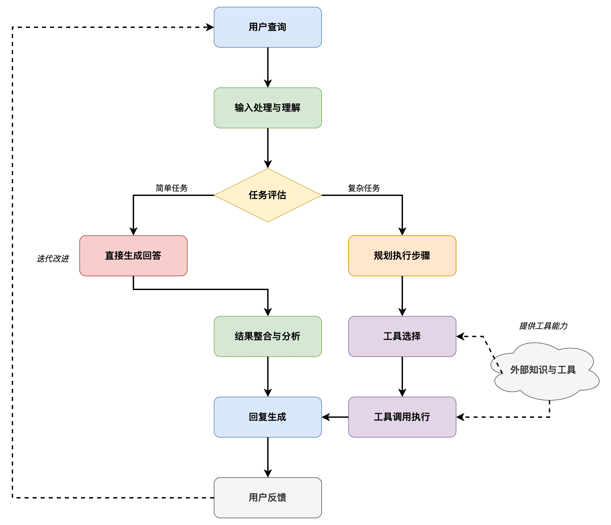

# 7.4 Agent

## 7.4.1 什么是 LLM Agent？

简单来说，大模型Agent是一个以LLM为核心“大脑”，并赋予其自主规划、记忆和使用工具能力的系统。 它不再仅仅是被动地响应用户的提示（Prompt），而是能够：

1. 理解目标（Goal Understanding）： 接收一个相对复杂或高层次的目标（例如，“帮我规划一个周末去北京的旅游行程并预订机票酒店”）。
2. 自主规划（Planning）： 将大目标分解成一系列可执行的小步骤（例如，“搜索北京景点”、“查询天气”、“比较机票价格”、“查找合适的酒店”、“调用预订API”等）。
3. 记忆（Memory）： 拥有短期记忆（记住当前任务的上下文）和长期记忆（从过去的交互或外部知识库中学习和检索信息）。
4. 工具使用（Tool Use）： 调用外部API、插件或代码执行环境来获取信息（如搜索引擎、数据库）、执行操作（如发送邮件、预订服务）或进行计算。
5. 反思与迭代（Reflection & Iteration）： （在更高级的Agent中）能够评估自己的行为和结果，从中学习并调整后续计划。

传统的LLM像一个知识渊博但只能纸上谈兵的图书馆员，而 LLM Agent 则更像一个全能的私人助理，不仅懂得多，还能跑腿办事，甚至能主动思考最优方案。

LLM Agent 通过将大型语言模型的强大语言理解和生成能力与规划、记忆和工具使用等关键模块相结合，实现了超越传统大模型的自主性和复杂任务处理能力，这种能力使得 LLM Agent 在许多垂直领域（如法律、医疗、金融等）都具有广泛的应用潜力。

## 7.4.2 LLM Agent 的类型

虽然LLM Agent的概念还在快速发展中，但根据其设计理念和能力侧重，我们可以大致将其分为几类：

任务导向型Agent（Task-Oriented Agents）：
- 特点： 专注于完成特定领域的、定义明确的任务，例如客户服务、代码生成、数据分析等。
- 工作方式： 通常有预设的流程和可调用的特定工具集。LLM主要负责理解用户意图、填充任务槽位、生成回应或调用合适- 的工具。
- 例子： 专门用于预订餐厅的聊天机器人、辅助编程的代码助手（如GitHub Copilot在某些高级功能上体现了Agent特性）。

规划与推理型Agent（Planning & Reasoning Agents）：
- 特点： 强调自主分解复杂任务、制定多步计划，并根据环境反馈进行调整的能力。它们通常需要更强的推理能力。
- 工作方式： 常采用特定的思维框架，如ReAct (Reason+Act)，让模型先进行“思考”（Reasoning）分析当前情况和所需行动，然后执行“行动”（Action）调用工具，再根据工具返回结果进行下一轮思考。Chain-of-Thought (CoT) 等提示工程技术也是其推理的基础。
- 例子： 需要整合网络搜索、计算器、数据库查询等多种工具来回答复杂问题的研究型Agent，或者能够自主完成“写一篇关于XX主题的报告，并配上相关数据图表”这类任务的Agent。

多Agent系统（Multi-Agent Systems）：
- 特点： 由多个具有不同角色或能力的Agent协同工作，共同完成一个更宏大的目标。
- 工作方式： Agent之间可以进行通信、协作、辩论甚至竞争。例如，一个Agent负责规划，一个负责执行，一个负责审查。
- 例子： 模拟软件开发团队（产品经理Agent、程序员Agent、测试员Agent）来自动生成和测试代码；模拟一个公司组织结构来完成商业策划。AutoGen、ChatDev等框架支持这类系统的构建。

探索与学习型Agent（Exploration & Learning Agents）：
- 特点： 这类Agent不仅执行任务，还能在与环境的交互中主动学习新知识、新技能或优化自身策略，类似于强化学习中的Agent概念。
- 工作方式： 可能包含更复杂的记忆和反思机制，能够根据成功或失败的经验调整未来的规划和行动。
- 例子： 能在未知软件环境中自主探索学习如何操作的Agent，或者在玩游戏时不断提升策略的Agent。

## 7.4.3 动手构造一个 Tiny-Agent

